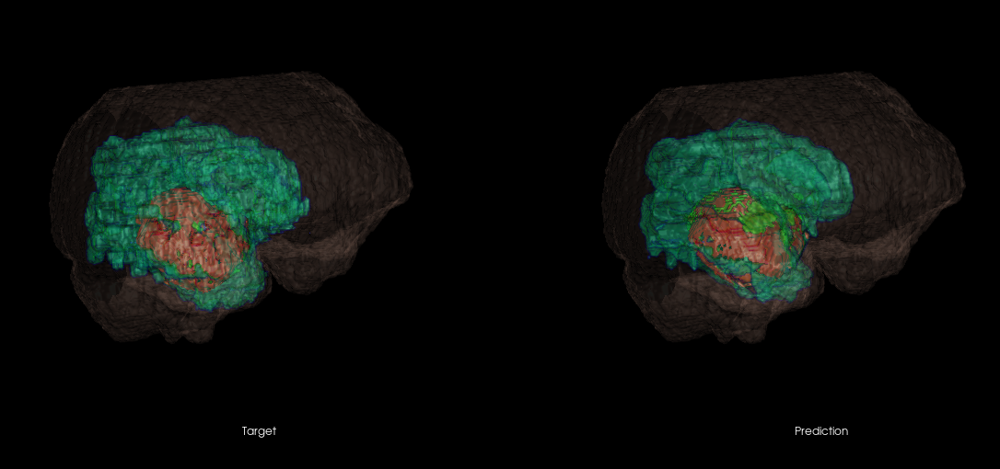
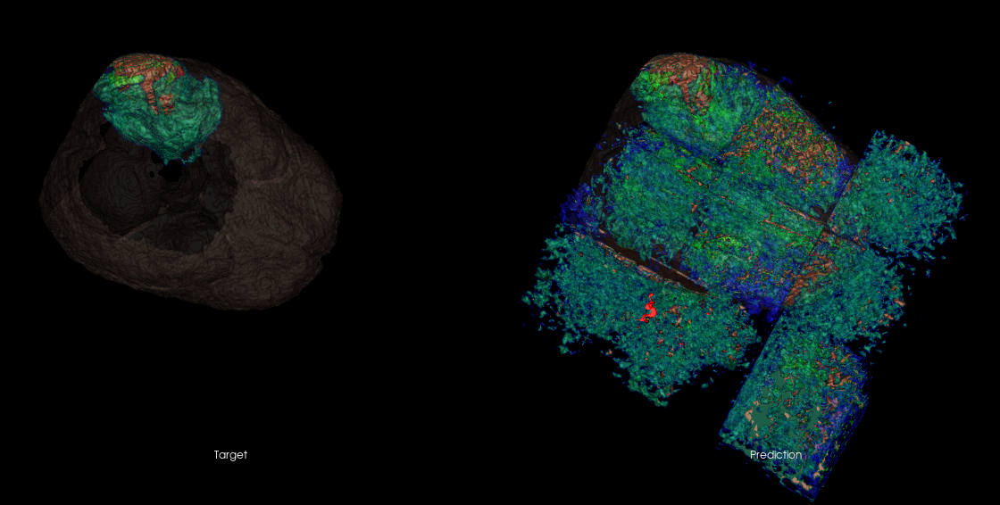
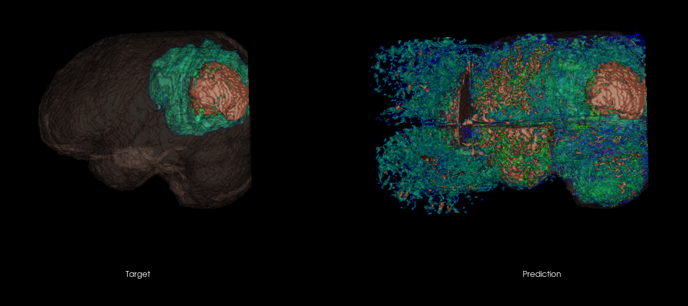

# PyTorch-UNet-BraTS20
## Introduction
This is a basic example of a PyTorch implementation of UNet from scratch. I've used it to segment the BraTS 2020 dataset, which contains CT scans of brains with tumors. As such, each entry has a list of 2D X-Ray slices that can be put together to form a volume. I have used VTK to render the mask vs. the prediction in 3D and thus show the usefulness of this approach. The model stops learning after only a few epochs, so for actual use, as a first cheap improvement, I'd recommend lowering the learning rate or increasing the amount of parameters in the network. The model achieves 0.75 F1 score and 98% accuracy (not very useful for semantic segmentation).

You can download the dataset I used from https://www.kaggle.com/awsaf49/brats20-dataset-training-validation. 

## Output Examples

## Basic Steps To Run The Code
*I recommend using Spyder or PyCharm in scientific mode, as after each epoch train.py prints out graphs of F1 and accuracy*
1. Download the Data
2. Modify hyperparameters.txt to fit your needs (at minimum, adjust the directories)
3. Run prepare_dataset.py
4. Run train.py
5. Optionally render output by running rendering.py

## Model
I have used a 3D UNet for this example. UNets were originally developed for use in medical computer vision, so it’s naturally a decent fit. I have kept to the original paper’s UNet architecture, thus the model has 64, 128, 256, 512 and 1024 features in each depth level. In my code, I made it trivial to update these numbers. 

More details at https://arxiv.org/pdf/1505.04597.pdf. 

## Training
The training methodology is kept very simple as complicated training is outside of scope for this example. I have used the PyTorch DataLoader and Dataset modules to handle the loading of the data for me. I have used a modified Dice Score (F1 Score) that I found in a paper that covers a similar problem https://arxiv.org/pdf/1606.04797.pdf. The paper claims that the modification helps to account for very imbalanced datasets by penalising the false positive prediction of the background class. For fun, I have used the https://twitter.com/karpathy/status/801621764144971776?lang=en Karpathy constant 3e-4 for learning, and Adam optimization. 

## Preparing the Dataset
To prepare the dataset, I’ve filtered out all of the entries of 100% healthy samples. As I attempted semantic segmentation, the background class is already going to be overrepresented compared to the other classes, so this pre-processing of the data should help slightly even out the classes without losing valuable data. 

Originally, I have cropped out 64x64x64 cubes around the tumor areas only. Although this worked well for modelling the tumor areas, the model ended up being really bad at identifying healthy areas of the brain and also labelling the “void” in the CT machine around the person, which meant that the rendered output was very poor. By removing this restriction, but still filtering out 100% healthy CTs, I achieved a fairly accurate model without a complicated training process. 

#### Examples of bad output when previously training the model having cropped out only the tumors in the training data

